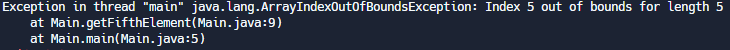

# Instructions  
### Description:
Exceptions in Java are an important part of any complete application to ensure continuous flow. An **exception** is simply a type Java object that is meant to “wrap” an event that causes an interruption to the typical flow of a program. These objects save key information about the state of the program at that moment in its runtime.  

When an interruption occurs, we may choose to account for this interruption by handling its Exception object using a try/catch block, or declaring that it be thrown if it occurs.


In this activity you will be learning about how to handle exceptions. Please follow the steps below:

### Steps:
1. Let's begin with an example. Add in the following static method below the **main()** method in **Main.java**:
```Java
  public static void getFifthElement(int[] array) {
     System.out.println(array[5]);
  }
```
This method takes in an int array and tries to print out the element at index 5. 

2. In the **main()** method, create an array of ints and assign it to a reference variable named **array**. The array should contain the following values: `1, 2, 3, 4, 5`.

3. Next, call the **getFifthElement()** method and use the array reference variable as its an argument. Run the program. In the console, you should output similar to the following error message:
   


Recall that arrays begin with index 0. This means that the last element in the array will have an index of 4. Trying to access a larger index will throw an exception and it will end the program.

4. To prevent our program from ending prematurely, let's **handle** the exception. Surround your previously created statement with a try/catch block like the example below:
```Java
  try{
    getFifthElement(array);
  } catch (Exception ex) {
    System.out.println("caught!");
    ex.printStackTrace();
  }
```
A **try** block is used to surround any statements that can potentially throw an exception. If an exception is thrown, the exception is passed to the **catch** block. The catch block takes in the exception and prevents it from interrupting the program. You can also use the **printStackTrace()** method to learn more about the exception, like what type it is and which methods were called that led to the exception occurring.

5. Now it's your turn. Add in the following Dog class definition to Dog.java:
```Java
public class Dog {

  public String name;
  
}
```
It simply defines an instance variable called **name**.

6. Add the following instance method inside of the Dog class:
```Java
  public void greet(Dog dog) {
    System.out.println("Woof, hello " + dog.name);
  }
```
This method takes in a dog object and uses its name to print out a greeting to the console.

7. Add in the following code to the **main()** method to test the **greet()** method:
```Java
Dog dog = new Dog();
Dog dog2 = null;

dog.greet(dog2);
```
After running the program, you should see a NullPointerException error message.

8. Surround the statement `dog.greet(dog2);` using a try block and use a catch block to print `caught!`. Run the program to check that you successfully caught the exception.

### Test:
Use the test provided. 

#### Sample output (Note: your stacktraces may look different than the below example, and that's okay):
```
caught!
java.lang.ArrayIndexOutOfBoundsException: Index 5 out of bounds for length 5
    at Main.getFifthElement(Main.java:25)
    at Main.main(Main.java:7)
caught!
```